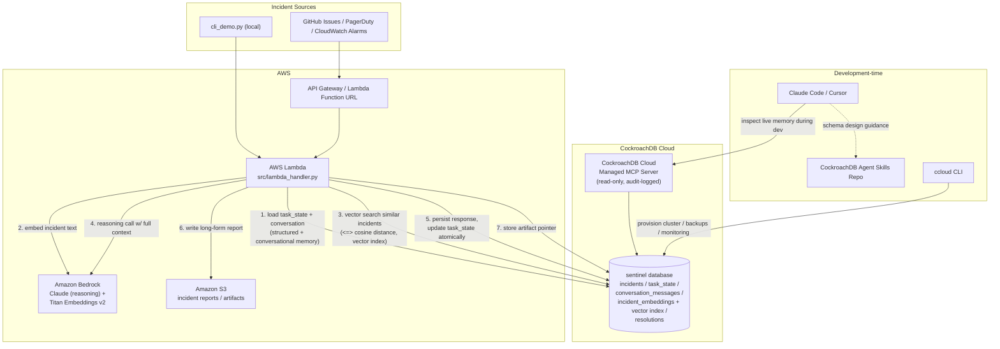

# Architecture

## Why CockroachDB is the memory layer, not just a database

- **`incidents` + `task_state`** give the agent a durable case file. If the
  Lambda invocation handling an incident dies mid-step (timeout, cold start
  eviction, deploy), the *next* invocation reads `task_state.step_index` and
  `scratchpad` and resumes -- no in-memory state is ever the source of truth.
- **`conversation_messages`** is full multi-turn memory per incident, so the
  agent (or a human via the `chat` CLI command) can pick a thread back up
  hours later with full context, without re-summarizing from scratch.
- **`incident_embeddings` + `CREATE VECTOR INDEX`** is long-term semantic
  memory: "have we seen something like this before, and what did we do?" --
  served by CockroachDB's Distributed Vector Indexing instead of a bolted-on
  vector DB, so the embedding and the transactional incident row are always
  consistent (no dual-write problem between an app DB and a vector store).
- All of the above are in the **same transaction boundary** where it
  matters -- e.g. `record_resolution` updates `resolutions` and flips
  `incidents.status` to `resolved` together.

## CockroachDB tools used (2+ required)

1. **CockroachDB Cloud Managed MCP Server** -- wired up in
   `mcp/mcp_config.example.json` for Claude Code / Cursor to query the live
   `sentinel` database directly during development (read-only, audit
   logged) -- e.g. inspecting `task_state` for a stuck incident without
   writing a debug script.
2. **CockroachDB Distributed Vector Indexing** -- `incident_embeddings`
   table + `CREATE VECTOR INDEX idx_incident_embeddings_ann` in
   `db/schema.sql`, queried in `src/memory.py::find_similar_incidents` via
   the `<=>` cosine-distance operator. This is the semantic memory that
   lets the agent recall similar past incidents and their resolutions.
3. **CockroachDB Agent Skills Repo** -- referenced during schema/query
   design; see `skills/README.md` for specifics.
4. **ccloud CLI** -- `deploy/deploy.sh --provision-db` uses it to provision
   the serverless cluster and print the connection string non-interactively.

## AWS services used (1+ required)

1. **Amazon Bedrock** -- `src/bedrock_agent.py` (Claude, for reasoning /
   triage decisions) and `src/embeddings.py` (Titan Text Embeddings v2, for
   the vectors stored in CockroachDB).
2. **AWS Lambda** -- `src/lambda_handler.py`, the serverless entrypoint that
   runs the whole agent step end-to-end; deployed via `deploy/template.yaml`
   (AWS SAM).
3. **Amazon S3** -- `src/artifacts.py` stores longer-form incident reports;
   CockroachDB keeps only the pointer (`resolutions.artifact_s3_key`).

## Data flow for one incident (see numbered edges above)

1. An incident comes in (webhook, alarm, or the `cli_demo.py new` command)
   and `memory.create_incident` writes it plus an initial `task_state` row.
2. `orchestrator.run_step` loads `task_state` + `conversation_messages` from
   CockroachDB.
3. The incident text is embedded via Bedrock and used to query
   `incident_embeddings` through the vector index for similar past
   incidents + their resolutions.
4. The current incident, similar incidents, and conversation history are
   sent to Bedrock's Claude model for the next triage step.
5. The response is appended to `conversation_messages` and `task_state` is
   updated -- all inside a CockroachDB transaction.
6. If the agent believes the incident is resolved, a Markdown report is
   written to S3 and a `resolutions` row is written pointing at it.
